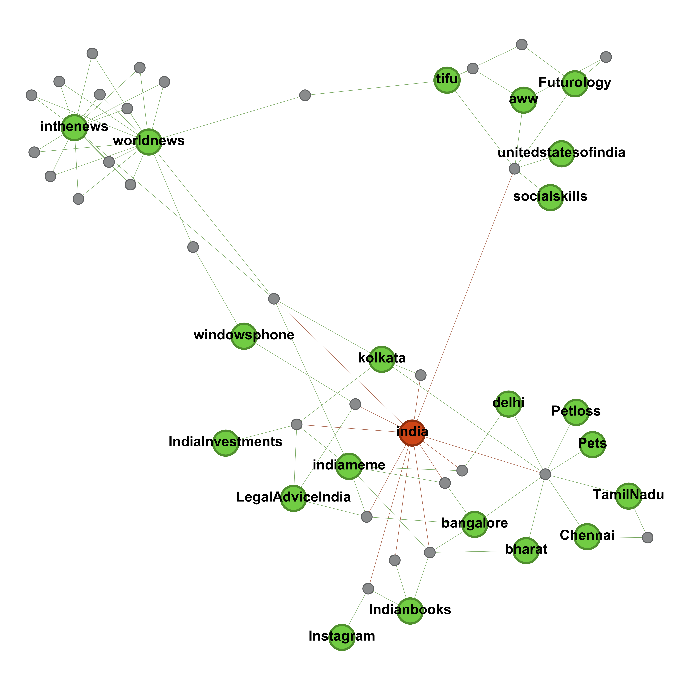
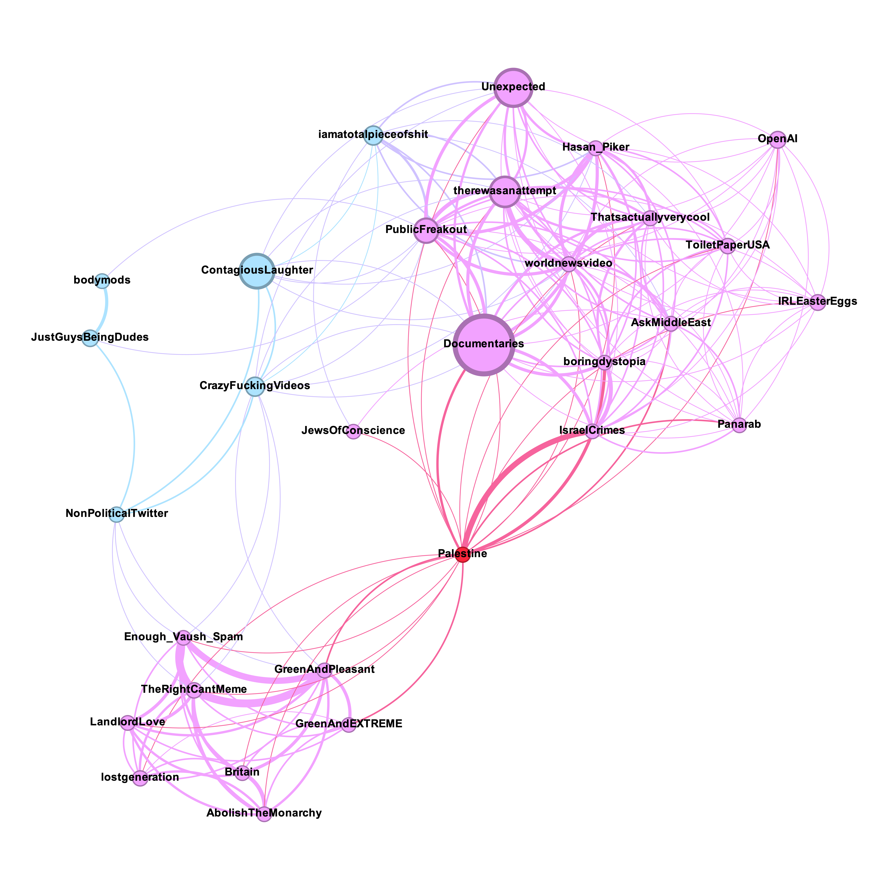

# RedditMods: Moderators of top-25'000 subreddits
 

_RedditMods_ is a dataset that lists moderators of 4'386 most popular communities on Reddit. The dataset is ideal for studying Reddit as a bipartite graph, where a moderator-node and a community-node are connected if the corresponding user moderates this subreddit. Clustering can then be performed to identify groups of subredits with a particular leaning, or to recommend similar communities.

## Data Collection

The data was scraped in the associated [Jupyter Notebook](code/reddit-mods-ds.ipynb). The data was publicly available and collected on 05-07 Oct 2024. All usernames were anonymised by hashing with SHA256, so that they cannot be linked to the moderators' Reddit accounts.

## Description of Files

The data is available both as a table and a bipartite graph.

#### GEXF – data in graph format

1. `graph.gexf`

	A bipartite graph, where nodes in the first group (having attribute `bipartite=0`) are moderators and nodes in the second group (having attribute `bipartite=1`) are subreddits. A moderator-node is connected with a subreddit-node if that moderator moderates this subreddit.
	
	Tags:
	* `size` on subreddit-nodes: number of subreddit's members
	* `last_active` on moderator-nodes: [unix timestamp](https://en.wikipedia.org/wiki/Unix_time) of the last post/comment this user has made in any subreddit
	* `is_suspended` on moderator-nodes: whether the user has been suspended
	* `is_bot` on moderator-nodes: whether the user was identified as a bot (by looking at their username or last comment)
	  
	

	
#### CSV – data in table format

1. `moderators.csv`

	Each row describes a subreddit-moderator pair:
	
	* `subreddit`: name of subreddit
	* `username`: username of moderator (anonymised by hashing)
	
	

2. `subreddits.csv`

	Contains 4.3K subreddits from the [list](http://www.reddit.com/subreddits/) of Reddit's most popular communities. The headers are:

	* `name`: name of subreddit
	* `n_members`: number of members
	
	

3. `users.csv`

	Moderators of communities from `subreddits.csv`
	
	* `username`: username of moderator (anonymised by hashing)
	* `last_active`: [unix timestamp](https://en.wikipedia.org/wiki/Unix_time) of the last comment/post this user made in any subreddit
	* `is_suspended`: whether the user has been suspended
	* `is_bot`: whether the user was identified as a bot (by looking at their username or last comment)

	

## Examples

* [Visualising a cluster of subreddits moderated by a group of users](./example/example.ipynb)

  
   

## Notes and warnings

I used a primitive procedure to identify bots based on a series of regular expressions. A better filtering might be necessary.
